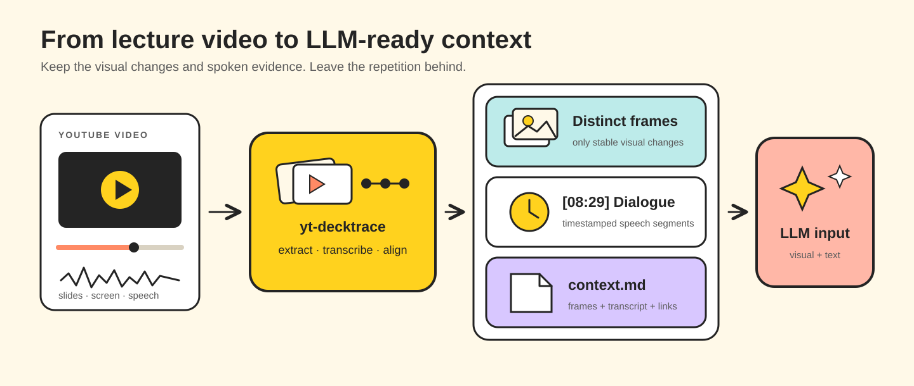
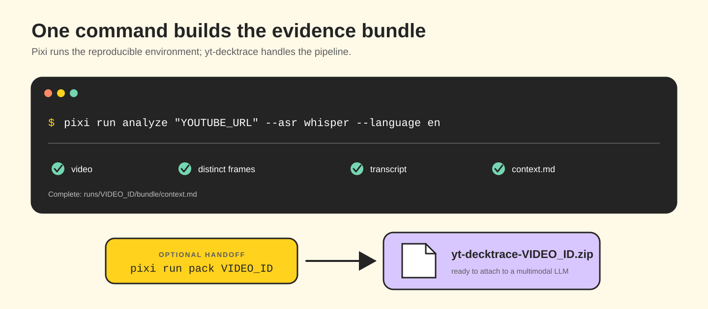
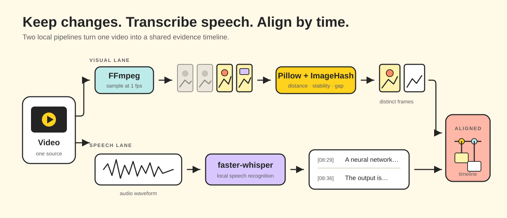

# yt-decktrace

Turn YouTube presentations into timestamped, LLM-ready context bundles.

`yt-decktrace` is a local-first pipeline that keeps meaningful visual changes,
transcribes the spoken timeline, and packages both as Markdown an LLM can navigate.
It avoids the cost and noise of sending every video frame to a model.



> [!NOTE]
> The first working environment targets Windows x64. Install
> [Pixi](https://pixi.sh/) and make FFmpeg available on `PATH`. A current NVIDIA
> driver enables CUDA transcription; the CPU path remains available.

## Quick start



Clone the repository, create the locked environment, and check the external
runtime dependencies:

```powershell
git clone https://github.com/intMinsu/yt-decktrace.git
cd yt-decktrace
pixi install
pixi run doctor
```

Analyze a presentation and package the completed run:

```powershell
pixi run analyze "https://www.youtube.com/watch?v=VIDEO_ID"
pixi run pack VIDEO_ID
```

By default, `analyze` uses an available Korean YouTube caption track and falls
back to local Whisper. To ignore captions and transcribe English speech locally:

```powershell
pixi run analyze "https://www.youtube.com/watch?v=VIDEO_ID" `
  --asr whisper --language en --model large-v3
```

The installed console command exposes the same interface:

```powershell
yt-decktrace analyze "https://www.youtube.com/watch?v=VIDEO_ID"
```

### Useful options

| Option | Purpose |
| --- | --- |
| `--asr auto\|youtube\|whisper` | Select the transcript source |
| `--language auto\|ko\|en` | Set Whisper language or enable detection |
| `--model MODEL` | Select a `faster-whisper` model |
| `--threshold N` | Adjust perceptual frame-change sensitivity |
| `--min-gap SECONDS` | Set the minimum gap between saved frames |
| `--force` | Regenerate downloaded and derived artifacts |

Run `pixi run analyze --help` or `pixi run pack --help` for the complete CLI.

## What it produces

Each video gets an isolated, resumable run directory:

```text
runs/VIDEO_ID/
├── manifest.json
├── source/
│   ├── metadata.json
│   └── captions.ko-orig.json3
├── frames/
│   ├── frames.json
│   ├── 00-00-04.jpg
│   └── 00-03-12.jpg
├── transcript/
│   ├── segments.json
│   └── transcript.md
└── bundle/
    ├── context.md
    ├── timeline.json
    └── yt-decktrace-VIDEO_ID.zip
```

The generated `context.md` links each visual change to its transcript context
and a clickable YouTube timestamp:

```markdown
## 00:03:12 — Playwright project structure

[Open on YouTube](https://www.youtube.com/watch?v=VIDEO_ID&t=192s)


The test harness separates the application lifecycle from the test lifecycle...
```

Downloaded media, generated runs, transcripts, and model weights are ignored by
Git.

## How it works



The visual lane samples the video with FFmpeg, compares perceptual hashes, ignores
short-lived transitions, and keeps a stable frame shortly after each meaningful
change. The speech lane uses an authored caption track when appropriate or local
`faster-whisper`. Both lanes are aligned by timestamp into one evidence timeline.

This design handles slide decks, IDE demos, and browser-based technical
presentations without treating every cursor movement or repeated frame as new
context.

## Real-world Whisper demo

The 41:07 English talk
[*35C3 – Introduction to Deep Learning*](https://media.ccc.de/v/35c3-9386-introduction_to_deep_learning)
was processed with local `faster-whisper` `large-v3` on CUDA while explicitly
ignoring the available YouTube captions.

| Result | Value |
| --- | ---: |
| Stable changed frames | 127 |
| Timestamped transcript segments | 314 |
| Source video | 128.6 MiB |
| LLM handoff ZIP | 135 files, 6.25 MiB |

```powershell
pixi run analyze "https://www.youtube.com/watch?v=2qJ1wrLcgx0" `
  --asr whisper --language en --model large-v3
pixi run pack 2qJ1wrLcgx0
```

The talk is published by media.ccc.de under
[CC BY 4.0](https://creativecommons.org/licenses/by/4.0/). No lecture media or
generated run artifact is committed to this repository.

## Hand off to GPT or another multimodal LLM

`pack` creates a compact ZIP without the original video or raw caption file. It
preserves the relative paths used by `context.md` and includes only the evidence
needed for analysis:

```text
START_HERE.md
manifest.json
bundle/context.md
bundle/timeline.json
frames/*.jpg
frames/frames.json
transcript/transcript.md
transcript/segments.json
source/metadata.json
```

Attach the ZIP as-is and start with a prompt such as:

```text
Read START_HERE.md first. Analyze the lecture using the transcript and relevant
frames together. Cite the YouTube timestamps for every important claim, and
separate what is visible on screen from what the speaker says.
```

Archive entries use stable ordering and timestamps, so identical run artifacts
produce an identical ZIP. Use `--output` to choose a destination or `--force` to
replace an existing archive:

```powershell
pixi run pack VIDEO_ID --output exports\presentation.zip --force
```

## Technology

| Concern | Tool |
| --- | --- |
| YouTube video and captions | `yt-dlp` |
| Decode, audio extraction, frame capture | FFmpeg |
| Stable perceptual change detection | Pillow + ImageHash |
| Local speech recognition | `faster-whisper` / CTranslate2 |
| Subtitle parsing | `pysubs2` |
| CLI and terminal output | Typer + Rich |
| Environment and lock file | Pixi |

## Development

Pixi provides Python and resolves the application, development, CUDA, cuBLAS,
and cuDNN packages from PyPI. The conda side intentionally contains only Python
to avoid mixed conda/PyPI runtime resolution. FFmpeg and the NVIDIA display
driver remain external dependencies.

```powershell
pixi install
pixi run doctor
pixi run lint
pixi run test
```

The current pins are Python 3.12, CUDA 12.9, and cuDNN 9. Model weights are not
vendored and are cached locally when Whisper is first used.

```text
src/yt_decktrace/   Python package and CLI
tests/              Unit and fixture-based integration tests
runs/               Generated per-video artifacts (not committed)
pyproject.toml       Python metadata and Pixi environment/tasks
pixi.lock            Reproducible environment lock
```

## Project status

- [x] YouTube ingest and Korean caption selection
- [x] Changed-frame detection and perceptual deduplication
- [x] CUDA/CPU `faster-whisper` fallback
- [x] Timestamp alignment and Markdown bundle generation
- [x] Compact, deterministic LLM handoff archive
- [x] Fixture-based pipeline tests
- [ ] Per-stage cache invalidation and incremental rebuilds

## Responsible use

Only process videos you are permitted to download and analyze. Users are
responsible for complying with YouTube's terms, copyright law, and the licenses
of generated or redistributed artifacts.
